# Guide

After installing and starting the server, open this link localhost:8000 in a web browser.

The first thing you will see is the empty list of accounts for the public services called “state accounts”.  
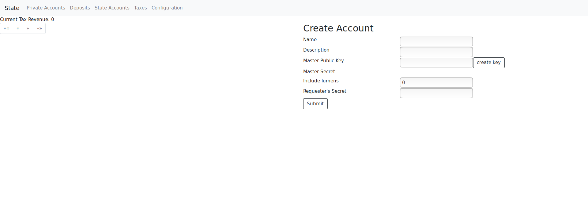

We will create a new state account for the Police.  
For the Master Public Key we press “Create Key” and we save the Master Secret to a text using an editor. This way we have a random key for authenticating payments from this account.  
For the ‘Include Lumens’ we add enough for the account to handle future Stellar fees.  
For the ‘Requester’s Secret’ we add the private key of an administrator.  
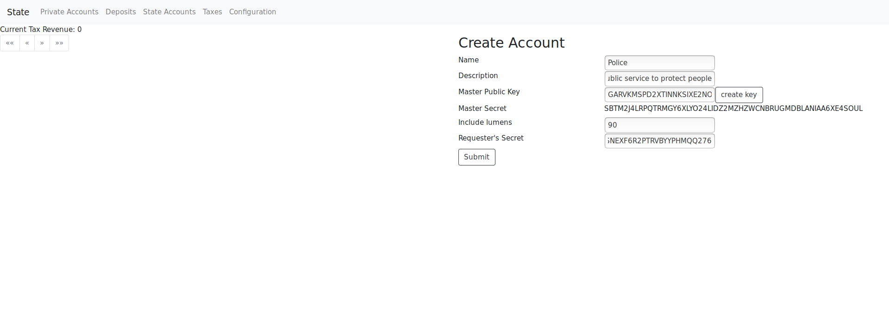

After submitting the creation of the state account, we can see it in the list of accounts.  
Moreover, these information public visible for all the people.  
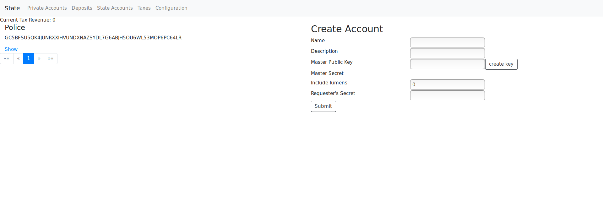

After pressing “show” of the state account we just created, it goes to another page with more details about the state account.  
It contains all the information about the assets and their amount.  
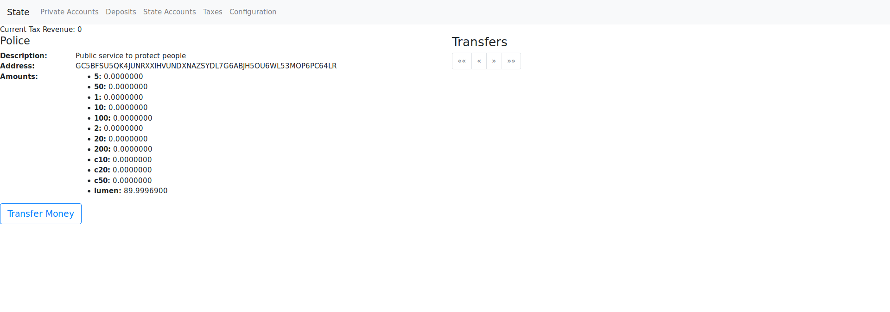

We see that all of the currencies have no amount because we didn’t transfer yet any money to the account.  
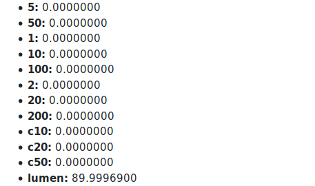

Now we will transfer money for the paycheck of a cheap police man.  
In the form we write down the private key of the admin, the reason of the transfer, the amount 1200 in our currency and that the source of the money will come from the ‘printer’ which will print new money.  
We don’t have to touch the input ‘receiver’ because it contains the public key of the state account, if you add another public key then you will receive an error from the state.  

After transfering the amount to the state account we can see the transfer in the list of transfers.  
Also we can see the amount of money we just added.  

We will add the state account as a private account to spend the money.  
Now we will submit the address of the state account and the master secret key of the state account (it is the one you saved in a text)  
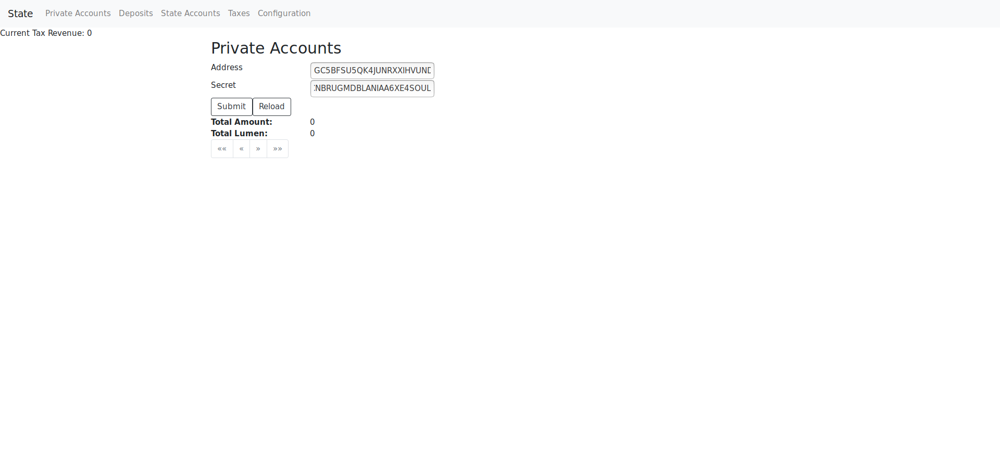

The submit will save the private account in the locale storage of the browser, for that reason you will not see it in the list of private accounts if you run the page from a private window  
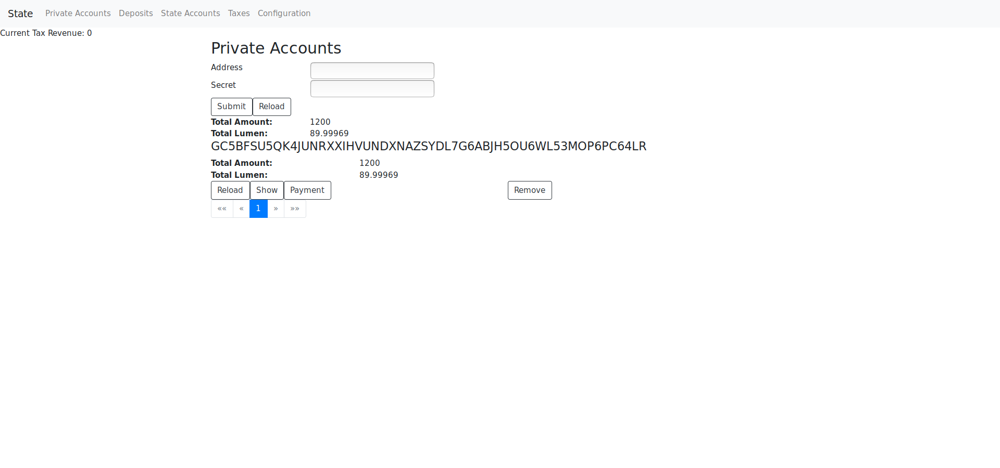

Now here is the plot twist, the cheap police officer is the administrator of the state and for that reason on the same browser we will create a new deposit by adding a password.  
However, we will press the button “Random” to let the system create a password for us.  
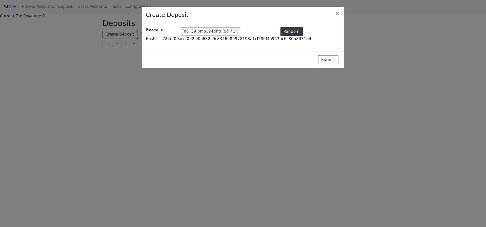

After submitting the deposit, we can see it in the list of deposits because it is saved in the locale storage of the browser and it will disappear if you open the same page from a private window.  

Now we will pay the wage for the first month by going back to the private accounts and press the button “Payment” to the only account that exists in the list.  
It open a form and we will add the hash of the deposit and the amount 1 next to the currency unit 100 , for the monthly wage of 100 euro.  
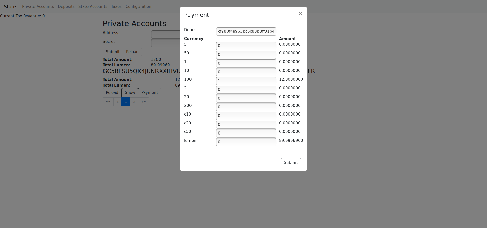

After submitting the payment and reloading the private accounts we can see that the total amount of the account has changed to 1100 from 1200  
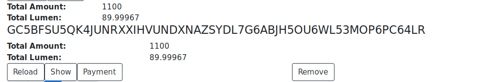

Also in the list of deposits and after pressing the button “Reload” we can see that it contains 100 euro.  
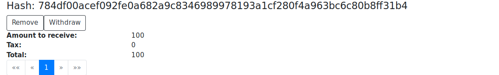

Now we will withdraw the money from the deposit and add them to our list of private accounts.  
Here we create a list of assets and for each one we will generate a new master key to control them.  
The total amount of the money has to be the same with the “Amount to receive”, or else it will not authorize the withdraw.  
On the submit the client will authorize the above arguments with the password of the deposit’s hash.  
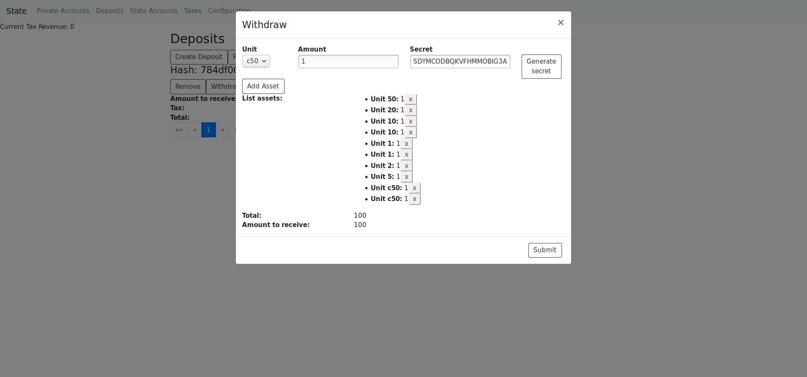

After submitting the withdraw, we reload the deposit and we can see that is empty.  
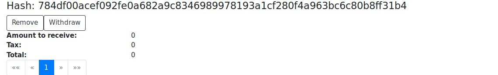

On the back-end the state will get the asset with the amount and each key, to create new account and replace the master key with the key received by the user so the state does not have control of the accounts.
The client receives the accounts and saves it in the list of private accounts.  
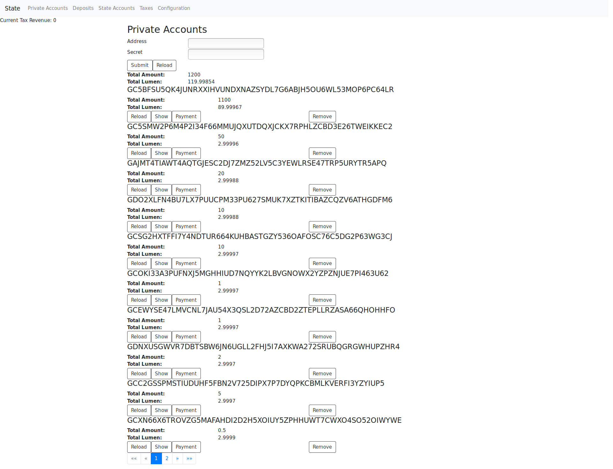

Now the cheap police officer understands that can not print money forever and the state has to pay his wage from taxes.
We open the page “Taxes” to submit the administrator’s secret key and 10% tax for each transaction.  
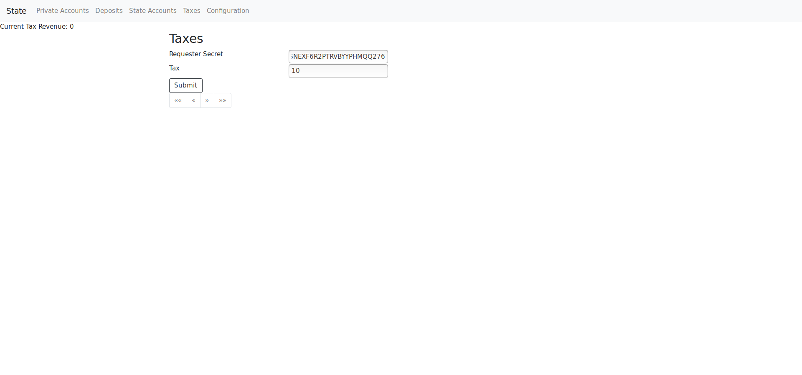

After submitting the tax we can see it in the list of taxes.  
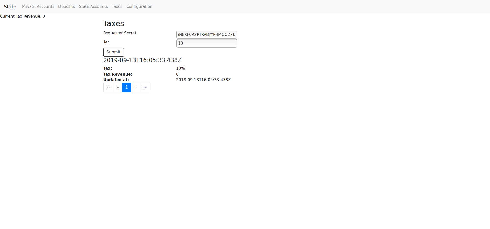

Now if we will add 100 euro to the same deposit, we will see that the state taxed the 100 euro with the 10% tax we just added.  

Now we will open the withdraw form and we will withdraw the 90 euro from the 100 euro.  
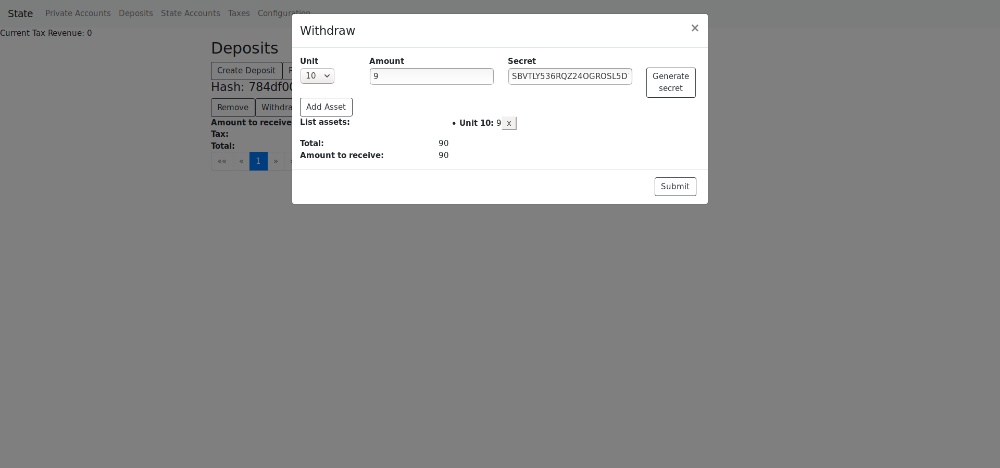

From this withdraw the state will receive 10 euro and for that reason the “Current Tax Revenue” will change from 0 to 10.  
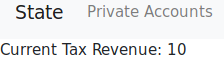

Now the state will transfer the 10 euro from the taxes to the police’s service account, by changing the source from ‘printer’ to ‘taxes’.  
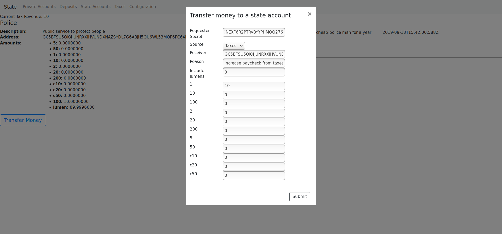

After transferring the money, we see in the list of transfers the money that the police received and from which source.  
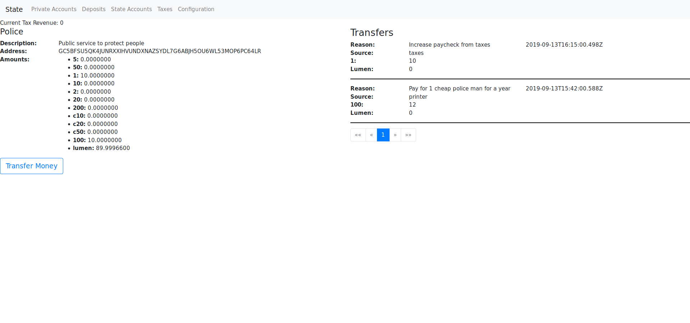

And if we reload the private account of the police service and press ‘show’, we will see the currency units we have which includes also the money from the tax.  
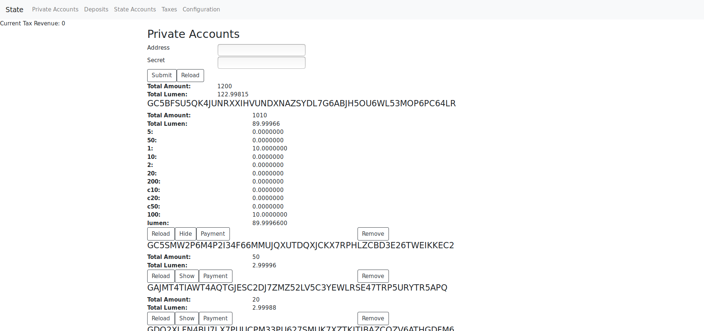
